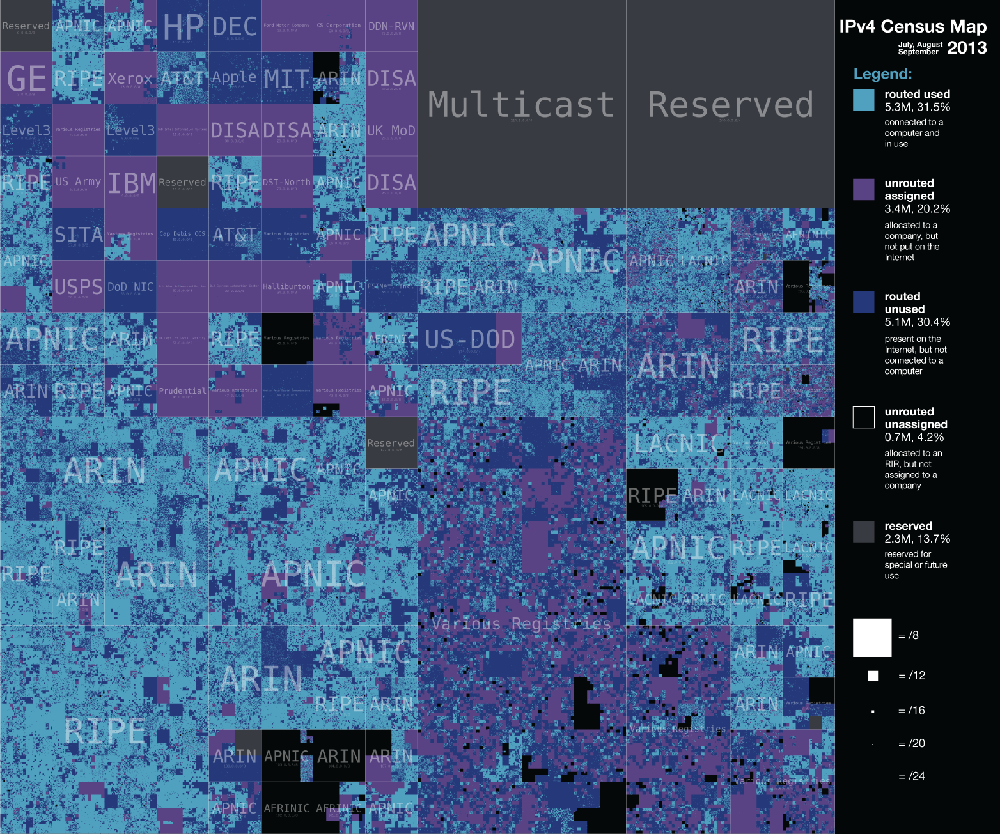

# IPv4 networking and subnetting fundamentals
---
Source:
- Video: [IPv4, CIDR, and VPC Subnets Made Simple!](https://www.youtube.com/watch?v=z07HTSzzp3o)
- Creator Channel: [Ryan Schachte](https://www.youtube.com/channel/UC0ckjBtm9SBV7JAjbELiBqQ)
- *Keyworkds: IPv4, CIDR, NAT-ing*
---

## What is an IPv4 addres?
This how devices communicate in the network, they are located by their IP address.
An IPv4 address is a sequence of numbres with this format:

<div align="center" style="font-size:60px; ">
	<div>
		<div style="
					display: inline-block; 
					position: relative">
			<div style="
					position: absolute; 
					font-size:12px;
					color: #8997AF;
					top: 13%;
					left: 50%;
					transform: translate(-50%, -60%);
					">Decimal Address</div>
			<span style="color:#8B4A99">172</span>.<span style="color:#BE3A32">16</span>.<span style="color:#F94F48">0</span>.<span style="color: #FBD02C">0</span>
		</div>
	</div>
	<div style="font-size:20px">
		<span style="position: relative">
			<span style="color:#8B4A99">10101100</span>.<span style="color:#BE3A32">00010000</span>.<span style="color:#F94F48">00000000</span>.<span style="color:#FBD02C">00000000</span>
			<div style="
					display: block;
					width: 200px;
					position: absolute; 
					font-size:12px;
					color: #BBD1E4;
					top: -50%;
					left: 50%;
					transform: translate(-50%, 0%);
					">Binary Address</div>
		</span>
	</div>
</div>

Characteristics:
- It consists of 4 octates, 1 octate = 8 bits
- It has a total size of 32 bits
- It has a maximum number of possible addresses of $2^{32}=4294967296$

## Classful Networking
We need to start explianing how networking was initially done, at the early days of the IPv4 there was an standard/pattern when creating networks named Classful or ABC networking. 
In classful networking we have 3 types of classes:
- **Class A**:  uses the first 8 bits for **net id**, the rest is for the host ids, this is aslo known as a /A Block. We are leaving 24 bits for IP addresses ($2^{24}$ addresses).
- **Class B**: uses the first 16 bits for net id, leaving $2^{16}$ possible addesses for the host ids
- **Class C**: uses the first 24 bits for net id, leaving $2^{8}$ possible addesses for the host ids.


<div align="center">
	<table>
		<colgroup>
			<th>Class Type</th>
			<th colspan="8">Oct 1</th>
			<th colspan="8">Oct 2</th>
			<th colspan="8">Oct 3</th>
			<th colspan="8">Oct 4</th>
		</colgroup>
		<tr>
			<td style="text-align: center;">A</td>
			<td colspan="1" style="text-align: center;">
				<br> 0
			</td>
			<td colspan="7" style="text-align: center;">
				7 bits <br>
				net id
			</td>
			<td colspan="24" style="text-align: center;">
				24 bits <br>
				host id
			</td>
		</tr>
		<tr>
			<td style="text-align: center;">B</td>
			<td colspan="2" style="text-align: center;">
				<br> 10
			</td>
			<td colspan="14" style="text-align: center;">
				14 bits <br>
				net id
			</td>
			<td colspan="16" style="text-align: center;">
				16 bits <br>
				host id
			</td>
		</tr>
		<tr>
			<td style="text-align: center;">C</td>
			<td colspan="3" style="text-align: center;">
				<br> 110
			</td>
			<td colspan="21" style="text-align: center;">
				21 bits <br>
				net id
			</td>
			<td colspan="8" style="text-align: center;">
				8 bits <br>
				host id
			</td>
	</table>
</div>

## The IPv4 shrinking problem
Initially when the IPv4 protocol was fist introduced a bunch of institutions started to buy blocks in the IPv4 block space.
Some institutions boug a lot of blocks but they were not using all of it, this caused a  shortage in the IPv4 block space and an overprice of the IPv4 blocks.



This map shows the status of the IPv4 space on 2016 and the different companies holding blocks.

In current years we have some new things happening: 
- The number of people in the internet incrased
- IoT is entering the space and taking over

**Resulting in the reduction of the available number of IPv4 addressed**

### Is there a solution?

- #### The ideal solution
	- Introducing IPv6: $3.4 * 10^{38}$ possible addresses
	- But many systems, software and hardware was desined with IPv4 in mind so switching was not so easy to do.
- #### The real solution
	- NAT and CIDR
		- Enable packet re-routing to private ips
		- It help to slow down the IPv4 exhaustion problem
		- It's not the best solution but it works

## What is NAT?
Network Address Translation, it allow us to re-direct request with a so called *NAT-Gateway*, a NAT-Gateway can be a router/modem that sits between the ISP/Internet and the end-user computer.
```none
                                       __           __            
          .-~~~-.                      ||           ||           .--. 
  .- ~ ~-(       )_ _                  ||           ||           |__| .-------. 
 /                    ~ -.             |+-----------+|           |=.| |.-----.| 
|         Internet         ', ======== +-------------+ ========= |--| ||     || 
 \                         .'          |    Router   |           |  | |'-----'| 
   ~- ._ ,. ,.,.,., ,.. -~             |69.100.150.40|           |__|~')_____(' 
                                       +-------------+            192.168.0.15

```

When a user sends a request for a IPv4 in the internet the NAT-Gateway intercepts the messages and sends it to the desired IPv4, once there's a response the NAT-Gateway uses the NAT Routing Table to send the message back to the host who made the request.

## What is CIDR?
Classless Inter-Domain Routing, it's an attempt to fix some of the issues with Classful Networking such as:
- You can only use IP classes A, B or C, not anything in between
- Wasting a lot of unused addresses

Some of the advanges the CIDR has over the old method are:
- Simple routing tables
- Reduces IPv4 exhaustion

The IPv4 ranges for private addresses are defined by **IANA**, the *Internet Assigned Numbers Authority*, and can be:

<div align="center">
	<table>
		<tr>
			<th colspan="2">Private IP address space</th>
		</tr>
		<tr>
			<th>FROM</th>
			<th>TO</th>
		</tr>
		<tr>
			<td>10.0.0.0</td>
			<td>10.255.255.255</td>
		</tr>
		<tr>
			<td>172.16.0.0</td>
			<td>172.31.255.255</td>
		</tr>
		<tr>
			<td>192.168.0.0</td>
			<td>192.168.255.255</td>
		</tr>
	</table>
</div>

Next we need to see the CIDR Notation, this notatios is similar to the IPv4 notation but it adds a new element, the Network Prefix Length that indicates how many bits are going to be used for the net id, in this example we are using 24 and that leaves the last 8 bits for the host id, this prefix can change depending how many addresses do we need.

<div align="center" style="font-size:60px; ">
	<div>
		<div style="
					border-style: dashed; 
					display: inline-block; 
					position: relative">
			<div style="
					position: absolute; 
					font-size:12px;
					color: #8997AF;
					top: -10%;
					left: 50%;
					transform: translate(-50%, -60%);
					">Address</div>
			<span style="color:#8B4A99">172</span>.<span style="color:#BE3A32">16</span>.<span style="color:#F94F48">0</span>.<span style="color: #FBD02C">0</span>
		</div>
		<span> / </span>
		<div style="
					position: relative;
					border-style: dashed; 
					border-color: black; 
					display: inline-block; 
					color:purple">
			<div style="
					display: block;
					width: 200px;
					position: absolute; 
					font-size:12px;
					color: red;
					top: -10%;
					left: 50%;
					transform: translate(-50%, -60%);
					">Network Prefix Length</div>
			<span>24</span>
		</div>
	</div>
	<div style="font-size:20px">
		<span style="position: relative">
			<span style="color:#8B4A99">10101100</span>.<span style="color:#BE3A32">001000</span>.<span style="color:#F94F48">00000000</span>
			<div style="
					display: block;
					width: 200px;
					position: absolute; 
					font-size:12px;
					color: red;
					top: 100%;
					left: 50%;
					transform: translate(-50%, 0%);
					">Network Prefix Length</div>
		</span>
		<span style="position: relative">
			.<span style="color:#FBD02C">00000000</span>
			<div style="
					display: block;
					width: 200px;
					position: absolute; 
					font-size:12px;
					color: #FBD02C;
					top: 100%;
					left: 50%;
					transform: translate(-50%, 0%);
					">Host id</div>
		</span>
	</div>
</div>

To get the total number of host ids that this CIDR will allow us to add we can use this formula:

$$
Total\ Host\ Ids=2^{32-Network\ Prefix\ Length}
$$

### CIDR Characteristics
- The start IPv4 of the range is the Address itself 
- The last IPv4 of the range can be optiained by **negating the binary interpretation of the Network Prefix Length mask**.

#### Obtaining the last IP from CIDR
For this example we are going to us **10.0.0.0/21** as our CIDR and we want to find the last ip of the range.
1) We take the Network Prefix Length and generate a mask, since the value is 21 the mask will have 21 ones at the begining and the rest will be zeros.

$$
mask: 11111111.11111111.11111000.00000000 
$$

2) Then we negate this mask, by negate we mean that all zeros will become ones and all ones will become zeros.

$$
negated: 00000000.00000000.00000111.11111111
$$

3) Now we take this negated mask and turn it into decimal form

$$
decimal: 0.0.7.255
$$

4) Construct the end ip by combining the last value with the original address

$$
\begin{aligned}
address: 10.0.0.0 \\
negated: 0.0.7.255\\
final\ ip:10.0.7.255
\end{aligned}
$$

From result from this example we know that
- Total host ids: 2,048 IPv4 addresses
- Start IP: 10.0.0.0
- End IP: 10.0.7.255

**Knowing this 3 things are important is because it allows you to figure out the possible combination of values you can use when creating subnets on a private network.**

### Creating a subnet

In this example we are going to use the last values to create a subnet that will have exactly 32 IPv4 addresses.
1) First by rearrenging the original formula we can get the new Network Prefix Length

$$
Total\ Host\ Ids=2^{32-Network\ Prefix\ Length}
$$


$$
\begin{aligned}
32=2^{32-N}\\
2^{32-N}=32\\
32-N=log{_2}{32}\\
N=32-log{_2}{32}\\
N=32-5\\
N=27
\end{aligned}
$$

2) Now we know that the Network Prefix Length is 27 and we have 5 bits at the end for the host id.

3) We need to decide in which part of the range do we want to add the subnet
	- if we want to use the first IPs on the range
		- 10.0.0.0/27 
	- if we we want to use the last 32 IPs on the range, note that the values for the last octate can be only multiples of 32 and less than the end range of 10.0.7.255.
		- 10.0.7.224/27
	-  we can use anything in between if we follow the last 2 rules
		-  10.0.2.32/27
		-  10.0.5.64/27
		-  10.0.1.0/27